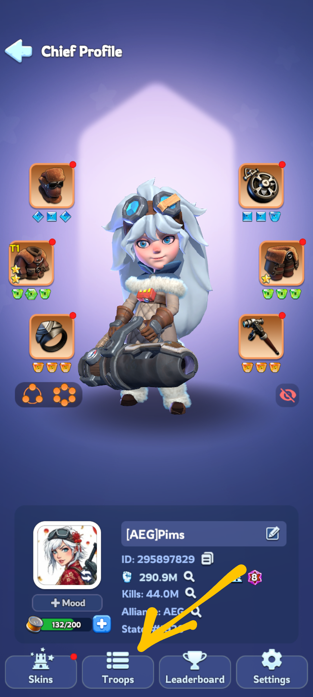
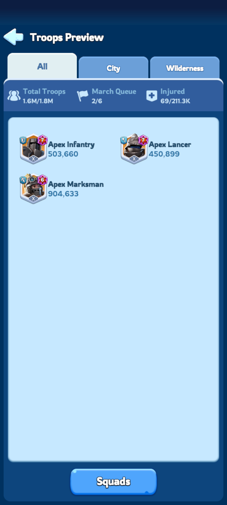
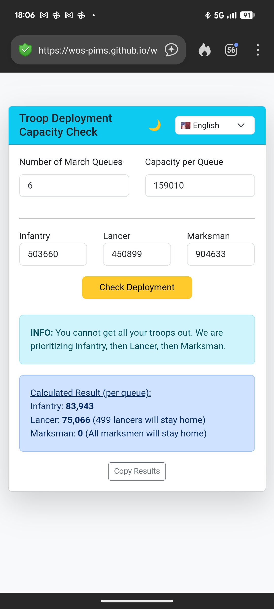

# 🍟 WOS CJ Troop Deployment Calculator

A lightweight, multilingual tool designed for **Whiteout Survival** players. 

This calculator helps optimize troop deployment in Crazy Joe

---

## 📍 Table of Contents
1. [Features](#-features)
2. [How It Works](#-how-it-works)
3. [How to find your numbers](#-how-to-find-your-numbers) 
4. [Credits](#-credits)

---

## ✨ Features

* **Smart Prioritization:** Automatically calculates marches by prioritizing **Infantry**, then **Lancers**, and finally **Marksmen**.
* **Multilingual Support:** Fully translated into 8 languages (English, French, Italian, Spanish, Polish, Turkish, Japanese, and Chinese) with native flags 🇺🇸 🇫🇷 🇮🇹 🇪🇸 🇵🇱 🇹🇷 🇯🇵 🇨🇳.
* **Auto-Save (Persistent Data):** Remembers your troop counts, march queues, and capacity using LocalStorage. Your data is ready whenever you return!
* **Dark Mode:** Detects system preferences automatically with a manual 🌙/☀️ toggle.
* **One-Tap Copy:** Quickly copy results to your clipboard for in-game chat or Discord.

---

## 🛠️ How It Works

The calculator uses a "greedy" fill algorithm based on your total capacity:
$$Total\ Capacity = Queues \times Capacity$$

1.  **Infantry First:** Fills the march with as much infantry as possible.
2.  **Lancer Second:** If there is remaining room, it adds Lancers.
3.  **Marksman Last:** Any remaining capacity is filled with Marksmen.
4.  **Error Handling:** If your Infantry count alone exceeds your total capacity, the app provides a warning and advice on how to handle the excess.

---

## ✨ How to find your numbers

| Chief profile | Number of Troops |
| :---: | :---: |
|  |  | 

| Capacity | Fill them up |
| :---: | :---: |
|  |  | 

---

## 🤝 Credits
Developed by Pims. If you like it, send me chips 🍟 and chips related arts in #1926 (ID 295897829)
